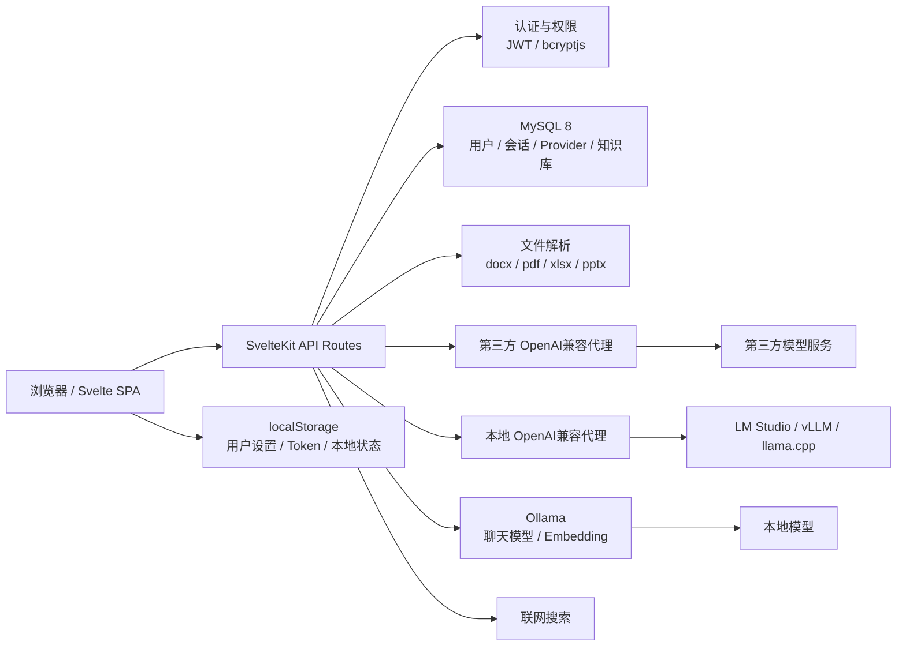
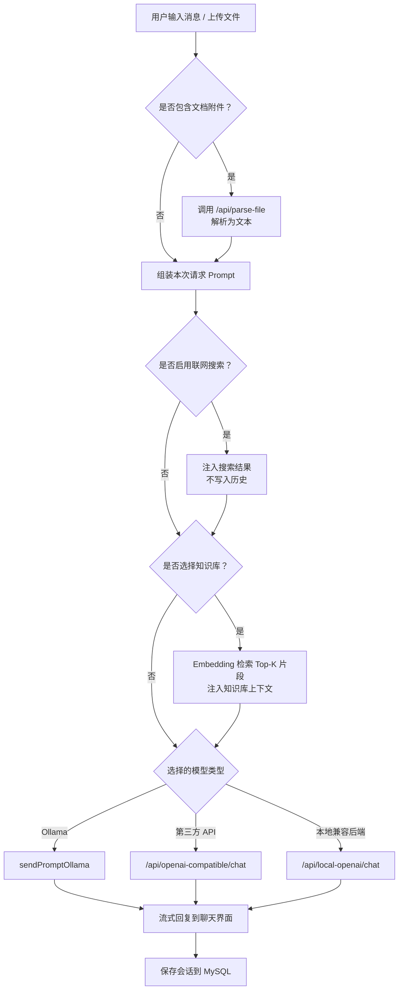

# 情感疗愈伴侣 (Emotional Healing Companion)

基于本地LLM（支持 Ollama、LM Studio、vLLM、llama.cpp）的情感支持聊天机器人。
项目优先支持本地私有化使用。
同时支持接入第三方 API 模型。
只为提供温暖、私密的交流体验。

## Agent 分支最新状态（2026-05-31）

- 新增会话级 `普通聊天 / Agent` 模式。Agent 模式可自主调用只读信息工具并输出带来源的 Markdown 结果。
- Agent v1 工具包括：实时联网时间、联网搜索、网页抓取、知识库查询、已上传文件上下文读取。
- 实时/最新/当前时间类问题优先使用实时联网工具；第三方 API 模型不会再依赖本机系统时间或模型旧知识回答当前时间。
- 知识库策略为“知识库优先，信息不足再联网”；对微博热搜等实时公共信息，系统会继续执行实时联网检索。
- 联网搜索已增强为实时查询，支持最近一天/一周/一月范围、来源 URL、发布时间/搜索时间元数据，并对微博热搜榜做结构化榜单抽取。
- 已开始的会话会锁定首次选择的模型、知识库和聊天模式；刷新页面不会把 Agent 会话切回普通聊天。
- 普通聊天发送后会立即显示 assistant 头像与跳动点，再执行知识库/联网搜索准备，减少“没反应”的等待感。
- 设置面板已简化：移除高级采样参数；上下文长度移动到偏好设置，默认 `200000` 字符上下文预算。
- 已修复侧边栏切换会话时 URL 改变但内容不刷新的问题。

## 最新状态（2026-05-30）

- README 已完成精简重构，并在技术栈部分加入系统架构图和核心流程图。
- MySQL 默认连接已标注配置文件 `src/lib/server/db.ts`，并说明可通过 `MYSQL_*` 环境变量覆盖。
- 第三方 API 配置文案统一为 `Base URL（OpenAI兼容）`。

## 功能概览

- 多模型聊天：Ollama、本地 OpenAI兼容后端、第三方 OpenAI兼容 API
- 信息整理 Agent：统一 JSON 工具协议、只读工具调用、步骤时间线、来源整理
- 流式回复：支持停止响应、重新生成、消息编辑、分支对话
- 文件解析：支持 `txt/md/csv/doc/docx/pdf/xls/xlsx/pptx`
- 知识库 RAG：文档上传、切片、Embedding、相似度检索、失败重试
- 联网搜索：实时搜索、最近时间范围、来源元数据、请求级注入，不写入本地历史
- 用户系统：注册、登录、个人资料、聊天记录、设置同步
- 安全处理：JWT、密码哈希、API Key 加密、DOMPurify、SSRF/Open Redirect 防护

## 技术栈

| 模块 | 技术 |
| --- | --- |
| 前端 | SvelteKit 1.x、Svelte 4、Tailwind CSS |
| 后端 | SvelteKit API routes、Node.js |
| 数据库 | MySQL 8、mysql2 |
| 模型 | Ollama、本地/第三方 OpenAI兼容 API |
| 文档解析 | mammoth、pdf-parse、xlsx、word-extractor、jszip |
| 安全 | bcryptjs、HMAC-SHA256 JWT、AES-256-GCM、DOMPurify |

### 系统架构图



### 核心流程图



## 快速开始

### 1. 准备环境

- Node.js 18+
- MySQL 8
- Ollama，可选但推荐

MySQL 默认连接（配置文件：`src/lib/server/db.ts`，也可通过下方 `MYSQL_*` 环境变量覆盖）：

```text
host: localhost
port: 3307
database: webui_chat
user: root
password:
```

创建数据库：

```sql
CREATE DATABASE IF NOT EXISTS webui_chat CHARACTER SET utf8mb4;
```

应用启动时会自动建表和执行轻量迁移。

### 2. 安装依赖

```bash
npm install
```

### 3. 启动开发服务

```bash
npm run dev
```

打开：

```text
http://localhost:8080
```

### 4. 可选：准备本地模型

```bash
ollama pull qwen3:0.6b
ollama pull nomic-embed-text
```

`nomic-embed-text` 用于知识库 Embedding。

## 环境变量

| 变量 | 默认值 | 说明 |
| --- | --- | --- |
| `MYSQL_HOST` | `localhost` | MySQL 主机 |
| `MYSQL_PORT` | `3307` | MySQL 端口 |
| `MYSQL_USER` | `root` | MySQL 用户 |
| `MYSQL_PASSWORD` | 空 | MySQL 密码 |
| `MYSQL_DATABASE` | `webui_chat` | MySQL 数据库 |
| `JWT_SECRET` | 内置默认值 | JWT 和 API Key 加密密钥，生产环境必须设置 |

## 模型接入

### Ollama

默认使用：

```text
http://localhost:11434/api
```

可以在设置面板中修改 Ollama 地址、拉取模型、删除模型、设置默认模型。

### 本地 OpenAI兼容后端

支持 LM Studio、vLLM、llama.cpp server 等本地服务。常用地址：

```text
LM Studio:        http://localhost:1234/v1
vLLM:             http://localhost:8000/v1
llama.cpp server: http://localhost:8081/v1
```

本地兼容后端只允许本机或内网地址，且不能填写当前应用自身地址。

### 第三方 API

在设置面板中添加 Provider：

- 名称
- Base URL（OpenAI兼容）
- API Key
- 模型列表

前端只保存和提交 `providerId`。API Key 和 Base URL 由服务端按当前用户读取、解密并代理转发，避免浏览器直连第三方服务。

## 知识库

知识库使用 Ollama Embedding。默认推荐：

```bash
ollama pull nomic-embed-text
```

流程：

1. 在设置面板创建知识库
2. 上传文档
3. 系统解析、切片、生成 Embedding
4. 聊天时选择知识库，相关片段会注入本次请求

知识库上下文只用于本次请求，不写入聊天历史。

## 文件上传

聊天上传支持：

```text
txt, md, csv, doc, docx, pdf, xls, xlsx, pptx
```

图片会作为附件展示。非图片文档会先解析成文本，再随用户输入一起发送给模型；聊天历史只保存附件元信息，不保存完整解析文本。

## 常用命令

```bash
npm run dev       # 开发服务，端口 8080
npm run typecheck # TypeScript 检查
npm run build     # 生产构建
npm run test      # Node 测试
npm run verify    # typecheck + build + test
npm run fmt       # Prettier 格式化
```

## 项目结构

```text
src/
  lib/
    chat/              # Ollama / OpenAI兼容聊天逻辑
    client/            # 浏览器端 HTTP、文件解析工具
    components/        # 聊天、设置、布局组件
    server/            # 认证、数据库、Provider、知识库逻辑
    stores/            # Svelte stores
    utils/             # 通用工具
  routes/
    api/               # 服务端 API
    (app)/             # 登录后的应用页面
    login/ register/   # 登录注册页面
static/                # 静态资源
scripts/               # 测试和维护脚本
```

## 验证

提交前建议运行：

```bash
npm run verify
git diff --check
```

当前已知的正常提示：

- 未设置 `JWT_SECRET` 时，构建会输出默认 secret 警告

## 生产构建

```bash
npm run build
node build
```

构建产物位于 `build/`。
